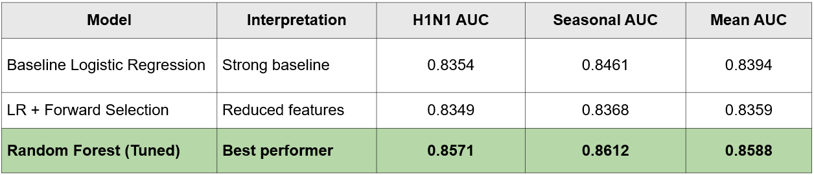
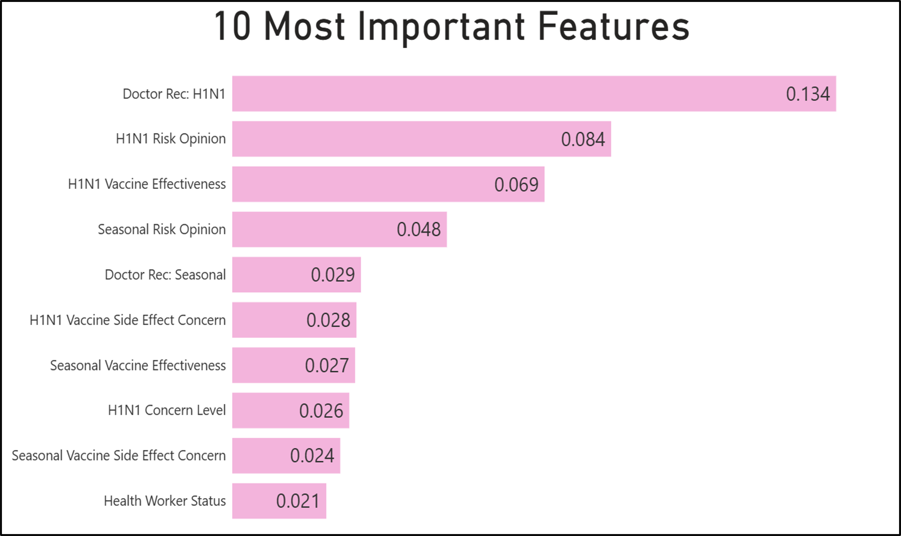
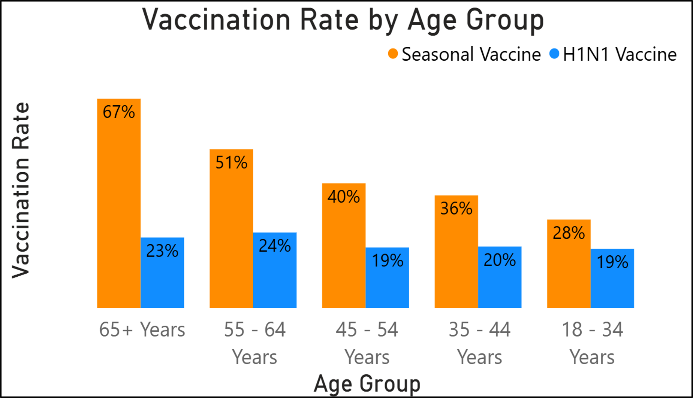

[**Home**](https://am-msba.github.io/Portfolio/) | [**MIP Optimizer**](https://am-msba.github.io/MIP_Optimization_Solver/)

# Predicting Flu Vaccination Likelihood 💉

## Background
In this project, I took a deep dive into the **National 2009 H1N1 Flu Survey** dataset. The goal was simple: use predictive modeling to figure out how likely someone was to get the **2009 H1N1 flu vaccine** and the **seasonal flu vaccine**. By analyzing survey responses, I wanted to see if we could spot the patterns behind why people choose to get vaccinated during a public health crisis.

---

## Methods
The main tools that were used for this project were Python for the data transformation and model creation, and PowerBI for the visualizations. The three models we used are shown below:

* **Logistic Regression**
* **LR + Forward Selection**
* **Tuned Random Forest**

---

## Results
The three models all had a mean AUC above 0.8, however the Tuned Random Forest model did better than the two other models with a mean AUC of 0.8588 compared to 0.8394 for the Logistic Regression and 0.8359 for the LR with Forward Selection Model. The difference may seem small, however when you look at the scale of the US population, two percent is about 6 million people which is a big number. 

  
   
  <i>Figure 1: Mean AUC Curve for each model.</i>

Some additional findings we discovered were that doctor recommendations serve as the single strongest predictor for the uptake of both vaccines. Additionally, age was found to be highly significant specifically for seasonal vaccine uptake. Finally, the analysis revealed that reducing features through forward selection actually decreased accuracy, which indicates that minor variables provide critical collective context for the model's performance.

  
   
  <i>Figure 2: Top features.</i>

  
   
  <i>Figure 3: Uptake of vaccines across age groups.</i>

